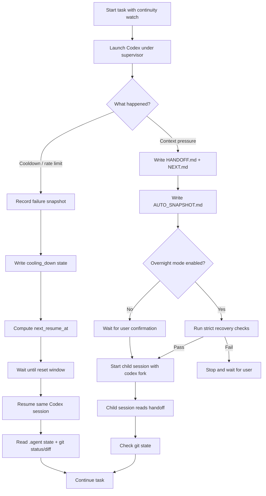

# Continuation Layer

> A durable continuation layer for Codex long-running CLI tasks.

Continuation Layer helps Codex tasks survive the places where long-running agent work usually breaks:

- cooldown / usage-limit walls,
- context compaction,
- interrupted sessions,
- stale resume state,
- overnight runs that need a human watching.

It does **not** bypass provider limits.
It does **not** rotate accounts.
It does **not** trust private chat history as the only source of truth.

Instead, it writes durable task state into your repository so a coding agent can pause, recover, and continue from the right place.

---

## What it does

| Problem                                           | Continuation Layer                                                 |
| ------------------------------------------------- | ------------------------------------------------------------------ |
| Codex hits a cooldown wall mid-task               | Watch mode waits for the reset window and resumes the same session |
| Context pressure risks losing important decisions | Handoff files are written before continuation                      |
| Resume looks connected but forgets task intent    | `.agent/` durable state is read before continuing                  |
| New sessions rescan the repo and waste tokens     | Child sessions recover from handoff, git status, and git diff      |
| Overnight work needs babysitting                  | Overnight mode is explicit and guarded by recovery checks          |

---

## Quick start

Initialize durable state in the repository you want to protect:

```sh
continuity init --task-id refactor-auth
```

Run long tasks through watch mode:

```sh
continuity watch "finish the auth refactor safely"
```

Watch mode is the recommended entry point for long-running tasks.

It starts Codex under a foreground supervisor. If Codex hits a cooldown wall, the supervisor records state, waits until the reset window, and automatically resumes the same Codex session.

```text
Codex running
  ↓
cooldown detected
  ↓
record next_resume_at
  ↓
wait through reset window
  ↓
resume same Codex session
  ↓
continue from .agent state
```

Check task state:

```sh
continuity status
continuity status --json
```

---

## Manual mode

Manual mode is available when you do not want a long-lived watchdog process:

```sh
continuity start "finish this task"
continuity resume
```

Manual mode runs once. If cooldown is detected, it records `next_resume_at` and exits.

It does **not** keep a process alive.
It does **not** wait through the reset window.
It does **not** automatically resume unless you run `continuity resume`.

Use `continuity watch` when you want automatic cooldown wait and same-session resume.

---

## Important limitation

Continuation Layer can only monitor provider processes that it starts.

If you run Codex directly:

```sh
codex
```

Continuation Layer cannot see that process, cannot capture cooldown events, cannot update `.agent/`, and cannot automatically resume it later.

For v0.1, use:

```sh
continuity watch "your task"
```

An interactive terminal wrapper for direct Codex-style usage is planned, but not included in v0.1.

---

## How it works



---

## Core ideas

### 1. Cooldown walls become resumable

When Codex hits a usage limit, rate limit, 429, or reset window, Continuation Layer does not force the request through.

It:

1. records a mechanical failure snapshot,
2. marks the task as `cooling_down`,
3. records `cooldown_detected_at`,
4. calculates `next_resume_at`,
5. records reset-time provenance,
6. waits in `watch` mode,
7. resumes the same Codex session after reset.

Reset time is calculated in this order:

```text
provider explicit reset timestamp
> provider relative reset duration
> usage_window_started_at + 5h + buffer
> cooldown_detected_at + 5h + buffer
```

If the final fallback is used, it is marked as `cooldown_detected_fallback`.

Cooldown resume is a same-session recovery path. A stale semantic handoff is a warning, not a blocker, because the cooldown wait itself may make the handoff older than the normal freshness gate.

Git conflicts, missing session id, corrupted state, and unreadable git state remain blockers.

---

### 2. Context pressure writes handoff before continuation

Context compaction can preserve the wrong details and drop the important ones.

Continuation Layer handles context pressure by writing durable handoff state before opening a continuation path:

```text
context pressure
  ↓
write HANDOFF.md
  ↓
write NEXT.md
  ↓
capture git/runtime snapshot
  ↓
ask for confirmation by default
  ↓
start child session with codex fork
```

Child continuation is stricter than cooldown resume. A stale, missing, or incomplete handoff can block child-session continuation and overnight automation.

---

### 3. Overnight mode is explicit and guarded

Overnight continuation is off by default.

Enable it explicitly:

```sh
continuity overnight enable
```

Then run continuation:

```sh
continuity continue
```

Before starting an unattended child session, Continuation Layer checks:

- handoff exists,
- `NEXT.md` exists,
- git state is coherent,
- parent session is traceable,
- no conflicts are present,
- recovery checks pass.

If recovery fails, automation stops and waits for the user.

Disable overnight mode:

```sh
continuity overnight disable
```

---

### 4. Completed tasks do not pollute new tasks

Mark the active task complete:

```sh
continuity complete
```

Start a fresh task:

```sh
continuity new-task --task-id next-task
```

The active handoff and snapshot are archived before new task state is written.

---

## Durable task state

Continuation Layer creates a `.agent/` directory in the protected repository.

```text
.agent/
  HANDOFF.md        active task handoff
  NEXT.md           exact next step
  DECISIONS.md      durable decisions
  AUTO_SNAPSHOT.md  mechanical git/runtime snapshot
  state.json        machine-readable task state
  sessions.jsonl    session chain and lifecycle events
  logs/             supervisor logs
  handoffs/         archived handoffs
  snapshots/        archived snapshots
```

These files make task state inspectable, auditable, and recoverable.

This repository dogfoods Continuation Layer. The committed `.agent/` directory is intentional and serves as a sanitized project-state example. It should not contain secrets, provider-private dumps, machine-local logs, or stale runtime noise.

---

## Install

Requirements:

- Node.js 20 or newer
- Git
- Codex CLI installed and authenticated
- A git repository where `.agent/` state can be written

Clone and install:

```sh
git clone https://github.com/Hsi431/continuation-layer.git
cd continuation-layer
npm install
```

Run from source:

```sh
node bin/continuity.mjs status
```

Or link the CLI locally:

```sh
npm link
continuity status
```

The Codex plugin package is included under:

```text
plugins/codex-continuity/
```

Without plugin installation, the CLI supervisor still works from the source tree.

---

## Commands

### Initialize

```sh
continuity init --task-id my-task
```

### Run with watchdog

```sh
continuity watch "finish this task"
```

### Run once

```sh
continuity start "finish this task"
```

### Resume after cooldown

```sh
continuity resume
```

### Write a snapshot

```sh
continuity snapshot
```

### Continue after context handoff

```sh
continuity continue
continuity continue --yes
```

`continue` writes handoff and waits for confirmation.
`continue --yes` runs recovery checks and starts a Codex child session with `codex fork`.

### Overnight mode

```sh
continuity overnight enable
continuity overnight disable
```

### Complete and reset task state

```sh
continuity complete
continuity new-task --task-id next-task
```

### Dry run

```sh
continuity start --dry-run "refactor safely"
continuity watch --dry-run "refactor safely"
continuity resume --dry-run
continuity continue --dry-run
```

---

## Codex integration

The Codex plugin package includes:

- continuity skill,
- lifecycle hooks,
- hook command script,
- plugin metadata.

Location:

```text
plugins/codex-continuity/
```

Hook behavior:

| Hook           | Behavior                                            |
| -------------- | --------------------------------------------------- |
| `SessionStart` | Inject compact continuity context                   |
| `Stop`         | Write `.agent/AUTO_SNAPSHOT.md`                     |
| `PreCompact`   | Record context pressure and write handoff           |
| `PostCompact`  | Record compaction and prefer `.agent` durable state |

Hooks do short lifecycle work. They do not sleep for hours.

Cooldown detection, waiting, and same-session resume are handled by the external supervisor.

---

## Safety boundaries

Continuation Layer is not a provider-limit bypass tool.

It does not:

- rotate accounts,
- fake reset windows,
- bypass cooldowns,
- sleep for hours inside hooks,
- auto commit,
- open pull requests automatically,
- force continuation from incomplete handoff,
- treat private provider session storage as source of truth,
- treat compacted summaries as the only source of truth.

It does one thing:

```text
Make long tasks pause legally, hand off explicitly, and recover safely.
```

---

## Current status

This is a Codex-first v0.1 preview.

Completed:

- durable `.agent` state and validation,
- Codex adapter and supervisor,
- cooldown watchdog and same-session automatic resume,
- reset-time provenance,
- Codex continuity skill and plugin package,
- Codex lifecycle hooks,
- context handoff,
- `codex fork` child continuation,
- guarded overnight auto-continuation,
- completion / archive / cleanup,
- behavioral acceptance rules in `AGENTS.md`.

---

## Known limitations

- v0.1 is Codex-first.
- Claude Code is documented as a future provider path, not a first-class runtime yet.
- Continuation Layer can only monitor provider processes it starts.
- Direct `codex` sessions are not captured.
- Interactive terminal wrapper support is planned, but not included in v0.1.
- Real provider smoke tests are opt-in and not part of CI.
- Context continuation asks for confirmation unless overnight mode is explicitly enabled.
- Provider CLI behavior and private session storage may change; private session storage is diagnostics only, not core state.

---

## Roadmap

### v0.1

- Codex CLI as primary provider
- Cooldown watchdog
- Same-session resume after cooldown
- Handoff-before-continuation
- Guarded overnight mode
- Completion / archive / cleanup
- Release packaging

### v0.x

- Dogfood feedback
- Packaging polish
- Clearer plugin installation flow
- Optional provider smoke tests
- Interactive terminal wrapper prototype

### v1

- Claude Code provider path
- Provider smoke tests
- Better circuit breaker policy
- Better recovery diagnostics

---

## Repository layout

```text
.agent/                     durable task state for this repo
.agents/skills/continuity   repo-local Codex skill entry
docs/                       architecture, safety, and release notes
plugins/codex-continuity/   Codex plugin package
plugins/claude-code-adapter/ future Claude Code adapter notes
src/                        core runtime, providers, supervisor
tests/                      unit and integration tests
AGENTS.md                   behavioral acceptance rules for agent work
```

---

## Development

Run tests:

```sh
npm test
```

Run syntax checks:

```sh
npm run check
```

Run formatting checks:

```sh
npm run format:check
```

Check package contents:

```sh
npm run pack:check
```

For manual release checks, see:

```text
docs/RELEASE_CHECKLIST.md
docs/DOGFOOD.md
```

---

## License

Apache-2.0
