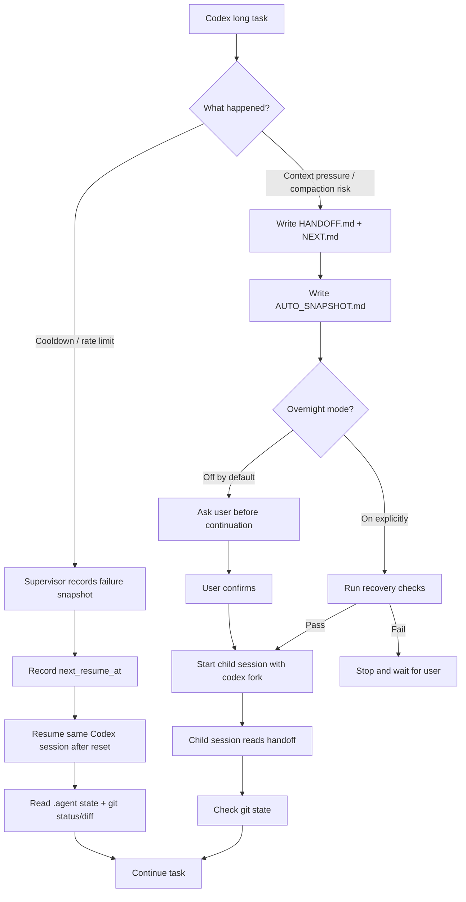

# Continuation Layer

[繁體中文](README.zh-TW.md)

> Let Codex long-running tasks survive cooldown walls, context compaction, and session interruption without losing the thread.

Continuation Layer is a task continuation layer for CLI coding agents.

When Codex runs a long task, the painful part is usually not whether it can write code. The painful part is that it can lose operational continuity right when the task is close to done:

- It hits a cooldown wall and stops mid-task.
- Context pressure triggers compaction and drops key decisions.
- A resumed session looks connected, but no longer remembers what was done.
- A new session scans the whole repo again and burns tokens rediscovering context.
- Overnight work still needs a human watching for stalls.

Continuation Layer writes task state into the repo so the agent can stop, hand off, recover, and continue from the right place.

```text
Not by trusting chat history.
Not by depending on private provider cache.
Not by rotating accounts or bypassing limits.

It works through durable state that is local, inspectable, traceable, and recoverable.
```

## The Flow



## What It Solves

### 1. Cooldown walls become resumable

When Codex hits a usage limit, rate limit, 429, or reset window, Continuation Layer does not force it, rotate accounts, or blindly restart.

It:

1. Records a failure snapshot.
2. Marks the task as cooling down.
3. Parses the reset time when available, or uses a conservative fallback.
4. Records `next_resume_at` as reset plus buffer.
5. Uses `codex resume` / `codex exec resume` to return to the same session when resume is invoked after reset.
6. Reads `.agent` state and git state before continuing.

```text
Cooldown wall
  ↓
record failure
  ↓
record legal resume time
  ↓
resume same session after reset
  ↓
continue from durable task state
```

### 2. Context pressure writes handoff before trusting compaction

Long tasks are fragile when context compaction keeps the wrong details and drops the important ones.

Continuation Layer handles context pressure by:

1. Detecting context pressure or `PreCompact`.
2. Writing handoff.
3. Writing the exact next step.
4. Capturing git/runtime snapshot.
5. Asking for confirmation before opening a continuation session by default.
6. Using `codex fork` to start a child session from the parent session.

```text
Context pressure
  ↓
write handoff before compaction
  ↓
ask user
  ↓
codex fork child session
  ↓
recover from .agent + git state
```

The child session does not need to guess the lost context or rescan the entire repo.

### 3. Overnight mode is explicit and guarded

By default, Continuation Layer will not start a child session on its own.

If you want unattended continuation while you sleep or step away, enable overnight mode:

```sh
node bin/continuity.mjs overnight enable
```

Once enabled, a completed context handoff can auto-start child continuation. It still checks:

- handoff exists,
- `NEXT.md` exists,
- git state is coherent,
- parent session is traceable,
- no conflicts are present,
- state is complete,
- recovery checks pass.

If recovery fails, automation stops and waits for you.

### 4. Completed tasks do not pollute new tasks

Phase 7 adds cleanup lifecycle commands.

Mark the active task complete:

```sh
node bin/continuity.mjs complete
```

Start a fresh task:

```sh
node bin/continuity.mjs new-task --task-id next-task
```

The active handoff and snapshot are archived before new active state is written. A new task does not inherit stale handoff text from the previous task.

## Durable Task State

Continuation Layer creates `.agent/` in the repo:

```text
.agent/
  HANDOFF.md          active task handoff
  NEXT.md             exact next step
  DECISIONS.md        durable decisions
  AUTO_SNAPSHOT.md    git/runtime mechanical snapshot
  state.json          machine-readable task state
  sessions.jsonl      parent/child session chain
  logs/               supervisor logs
  handoffs/           handoff archive
  snapshots/          snapshot archive
```

These files make task state readable, auditable, and recoverable.

## Usage

Initialize:

```sh
node bin/continuity.mjs init --task-id refactor-auth
```

Check status:

```sh
node bin/continuity.mjs status
node bin/continuity.mjs status --json
```

Start Codex under supervisor:

```sh
node bin/continuity.mjs start "refactor the auth module safely"
```

Write a snapshot:

```sh
node bin/continuity.mjs snapshot
```

Continue after context handoff:

```sh
node bin/continuity.mjs continue
node bin/continuity.mjs continue --yes
```

`continue` writes handoff and waits for confirmation. `continue --yes` runs recovery checks and starts a Codex child session with `codex fork`.

Overnight mode:

```sh
node bin/continuity.mjs overnight enable
node bin/continuity.mjs continue
```

Disable it:

```sh
node bin/continuity.mjs overnight disable
```

Completion and cleanup:

```sh
node bin/continuity.mjs complete
node bin/continuity.mjs new-task --task-id next-task
```

## Highlights

- Codex-first v0.
- Same-session resume after recorded cooldown reset.
- Handoff before continuation under context pressure.
- Child continuation uses `codex fork`.
- `.agent` durable state is the source of truth.
- Parent/child session chain is traceable.
- Overnight mode is off by default and must be explicitly enabled.
- Failed recovery checks stop automation.
- Supervisor owns cooldown detection and resume state.
- Hooks do short lifecycle work and do not sleep for hours.
- Task completion / archive / cleanup is implemented.
- No account rotation.
- No provider-limit bypass.
- No automatic commits.

## Codex Integration

The Codex plugin package lives in:

```text
plugins/codex-continuity/
```

It includes:

- continuity skill,
- lifecycle hooks,
- hook command script,
- plugin metadata.

Hook behavior:

| Hook | Behavior |
| --- | --- |
| `SessionStart` | Inject compact continuity context |
| `Stop` | Write `.agent/AUTO_SNAPSHOT.md` |
| `PreCompact` | Record context pressure and write handoff |
| `PostCompact` | Record compaction and prefer `.agent` durable state |

## Safety Boundaries

Continuation Layer is not a provider-limit bypass tool.

It does not:

- rotate accounts,
- fake reset windows,
- sleep for hours inside hooks,
- auto commit,
- open PRs automatically,
- force continuation from incomplete handoff,
- treat private provider session storage as core state,
- treat compacted summaries as the only source of truth.

It does one thing:

```text
Make long tasks pause legally, hand off explicitly, and recover safely.
```

## Current Status

This is a Codex-first preview that can run the core continuity flow.

Completed:

- Durable `.agent` state and validation
- Codex adapter and supervisor
- Cooldown detection and same-session resume state
- Codex continuity skill and plugin package
- Codex lifecycle hooks
- Context handoff
- `codex fork` child continuation
- Guarded overnight auto-continuation
- Completion / archive / cleanup

## Roadmap

### v0

- Codex CLI as the primary provider.
- Safe cooldown resume state.
- Handoff-before-continuation.
- Guarded overnight mode.
- Completion / archive / cleanup.
- Release polish and packaging.

### v1

- Claude Code provider path.
- `claude --resume`
- `claude --continue`
- `claude --fork-session`
- Claude `StopFailure` integration.
- Provider smoke tests.
- Better circuit breaker and recovery policy.

## Repository Layout

```text
.agent/                         durable task state for this repo
.agents/skills/continuity       repo-local Codex skill entry
docs/                           architecture, safety, and research notes
plugins/codex-continuity/       Codex plugin package
plugins/claude-code-adapter/    future Claude Code adapter notes
src/                            core runtime, providers, supervisor
tests/                          unit and integration tests
FINDINGS.md                     Phase 0 findings
PLAN.md                         implementation plan
```

## Development

Run tests:

```sh
npm test
```

Run syntax checks:

```sh
npm run check
```

Validate Codex skill and plugin:

```sh
python3 /home/fnata_claw/.codex/skills/.system/skill-creator/scripts/quick_validate.py plugins/codex-continuity/skills/continuity
python3 /home/fnata_claw/.codex/skills/.system/plugin-creator/scripts/validate_plugin.py plugins/codex-continuity
```

## License

Apache-2.0
