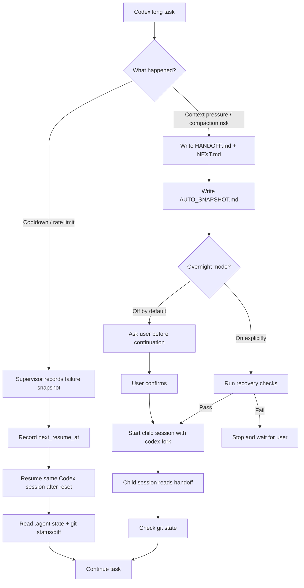

# Continuation Layer

[繁體中文](README.zh-TW.md)

> Let Codex long-running tasks survive cooldown walls, context compaction, and session interruption without losing the thread.

Continuation Layer is a task continuation layer for CLI coding agents.

When Codex runs a long task, the painful part is usually not whether it can write code. The painful part is that it can lose operational continuity right when the task is close to done:

- It hits a cooldown wall and stops mid-task.
- Context pressure triggers compaction and drops key decisions.
- A resumed session looks connected, but no longer remembers what was done.
- A new session scans the whole repo again and burns tokens rediscovering context.
- Overnight work still needs a human watching for stalls.

Continuation Layer writes task state into the repo so the agent can stop, hand off, recover, and continue from the right place.

```text
Not by trusting chat history.
Not by depending on private provider cache.
Not by rotating accounts or bypassing limits.

It works through durable state that is local, inspectable, traceable, and recoverable.
```

## Problem / Before-After

| Before                                         | After                                                     |
| ---------------------------------------------- | --------------------------------------------------------- |
| Cooldown walls stop the task mid-run           | Watch mode waits for reset and resumes the same session   |
| Context compaction can drop key decisions      | Handoff is written before continuation                    |
| Resume can look connected but lose task intent | `.agent` durable state is read before continuing          |
| New sessions rescan the repo and burn tokens   | Child sessions recover from handoff, git status, and diff |
| Overnight runs need constant babysitting       | Overnight mode is explicit and guarded by recovery checks |

## Highlights

- Codex-first v0.1 preview.
- Long-lived cooldown watchdog with same-session resume.
- Handoff before continuation under context pressure.
- Child continuation uses `codex fork`.
- `.agent` durable state is the source of truth.
- Parent/child session chain is traceable.
- Overnight mode is off by default and must be explicitly enabled.
- Failed recovery checks stop automation.
- Supervisor owns cooldown detection, wait, and same-session resume.
- Hooks do short lifecycle work and do not sleep for hours.
- Task completion / archive / cleanup is implemented.
- No account rotation.
- No provider-limit bypass.
- No automatic commits.

## Safety Boundaries

Continuation Layer is not a provider-limit bypass tool.

It does not:

- rotate accounts,
- fake reset windows,
- sleep for hours inside hooks,
- auto commit,
- open PRs automatically,
- force continuation from incomplete handoff,
- treat private provider session storage as core state,
- treat compacted summaries as the only source of truth.

It does one thing:

```text
Make long tasks pause legally, hand off explicitly, and recover safely.
```

Watch mode waits for provider reset windows. It does not bypass limits, rotate accounts, fake reset times, or sleep inside hooks.

## The Flow



## What It Solves

### 1. Cooldown walls become resumable

When Codex hits a usage limit, rate limit, 429, or reset window, Continuation Layer does not force it, rotate accounts, or blindly restart.

It:

1. Records a failure snapshot.
2. Marks the task as cooling down.
3. Parses the reset time when available, or uses a provenance-labeled fallback.
4. Records `next_resume_at` as reset plus buffer.
5. In watch mode, waits in the foreground supervisor until reset.
6. Uses `codex resume` / `codex exec resume` to return to the same session.
7. Reads `.agent` state and git state before continuing.

```text
Cooldown wall
  ↓
record failure
  ↓
record legal resume time
  ↓
watch waits through reset window
  ↓
resume same session after reset
  ↓
continue from durable task state
```

If the provider does not expose an exact reset time, Continuation Layer estimates it from `usage_window_started_at + 5h + buffer`. If no anchor exists, it falls back to `cooldown_detected_at + 5h + buffer` and marks the provenance as `cooldown_detected_fallback`.

Cooldown resume is a same-session recovery path. A stale semantic handoff is treated as a warning, not a blocker, because the provider may already be rejecting requests and the cooldown wait itself can make handoff age exceed the normal freshness gate. Recovery uses the same session id, mechanical snapshot, git state, provider logs, and resume prompt.

Child continuation remains strict. A stale, missing, or incomplete handoff can still block child-session continuation and overnight automation.

If watch is interrupted during cooldown, running `continuity watch` again adopts the existing `cooling_down` state, waits until the recorded `next_resume_at`, and resumes the same session instead of starting a new provider task.

### 2. Context pressure writes handoff before trusting compaction

Long tasks are fragile when context compaction keeps the wrong details and drops the important ones.

Continuation Layer handles context pressure by:

1. Detecting context pressure or `PreCompact`.
2. Writing handoff.
3. Writing the exact next step.
4. Capturing git/runtime snapshot.
5. Asking for confirmation before opening a continuation session by default.
6. Using `codex fork` to start a child session from the parent session.

```text
Context pressure
  ↓
write handoff before compaction
  ↓
ask user
  ↓
codex fork child session
  ↓
recover from .agent + git state
```

The child session does not need to guess the lost context or rescan the entire repo.

### 3. Overnight mode is explicit and guarded

By default, Continuation Layer will not start a child session on its own.

If you want unattended continuation while you sleep or step away, enable overnight mode:

```sh
continuity overnight enable
```

Once enabled, a completed context handoff can auto-start child continuation. It still checks:

- handoff exists,
- `NEXT.md` exists,
- git state is coherent,
- parent session is traceable,
- no conflicts are present,
- state is complete,
- recovery checks pass.

If recovery fails, automation stops and waits for you.

### 4. Completed tasks do not pollute new tasks

v0.1 includes cleanup lifecycle commands.

Mark the active task complete:

```sh
continuity complete
```

Start a fresh task:

```sh
continuity new-task --task-id next-task
```

The active handoff and snapshot are archived before new active state is written. A new task does not inherit stale handoff text from the previous task.

## Durable Task State

Continuation Layer creates `.agent/` in the repo:

```text
.agent/
  HANDOFF.md          active task handoff
  NEXT.md             exact next step
  DECISIONS.md        durable decisions
  AUTO_SNAPSHOT.md    git/runtime mechanical snapshot
  state.json          machine-readable task state
  sessions.jsonl      parent/child session chain
  logs/               supervisor logs
  handoffs/           handoff archive
  snapshots/          snapshot archive
```

These files make task state readable, auditable, and recoverable.

This repository dogfoods Continuation Layer. The committed `.agent/` directory is intentional and serves as a real project-state example. It should not contain provider-private session dumps, secrets, or machine-local logs.

## Install

Requirements:

- Node.js 20 or newer.
- Git.
- Codex CLI installed and authenticated.
- A git repository where `.agent/` durable state can be written.

Clone and install:

```sh
git clone https://github.com/Hsi431/continuation-layer.git
cd continuation-layer
npm install
```

Use from the source tree:

```sh
node bin/continuity.mjs status
```

Or link the CLI locally:

```sh
npm link
continuity status
```

The Codex plugin package is included under `plugins/codex-continuity/`. For local dogfooding, install or link that plugin through your Codex plugin workflow, then start a new Codex thread so hooks and skills are loaded. Without plugin installation, the CLI and supervisor still work from the source tree.

## Quick Start

From the repo you want to protect:

Initialize:

```sh
continuity init --task-id refactor-auth
```

Check status:

```sh
continuity status
continuity status --json
```

## Recommended: Watch mode

```sh
continuity watch "finish this task"
```

Watch mode keeps the supervisor alive, waits through cooldown windows, and automatically resumes the same Codex session.

## Manual mode

```sh
continuity start "finish this task"
continuity resume
```

Manual mode detects cooldowns, records `next_resume_at`, then exits. It does not keep a process alive.

Start Codex under the manual one-shot supervisor:

```sh
continuity start "refactor the auth module safely"
```

Write a snapshot:

```sh
continuity snapshot
```

Continue after context handoff:

```sh
continuity continue
continuity continue --yes
```

`continue` writes handoff and waits for confirmation. `continue --yes` runs recovery checks and starts a Codex child session with `codex fork`.

Overnight mode:

```sh
continuity overnight enable
continuity continue
```

Disable it:

```sh
continuity overnight disable
```

Completion and cleanup:

```sh
continuity complete
continuity new-task --task-id next-task
```

Dry-run provider commands without launching Codex:

```sh
continuity start --dry-run "refactor the auth module safely"
continuity watch --dry-run "refactor the auth module safely"
continuity resume --dry-run
continuity continue --dry-run
```

## Codex Integration

The Codex plugin package lives in:

```text
plugins/codex-continuity/
```

It includes:

- continuity skill,
- lifecycle hooks,
- hook command script,
- plugin metadata.

Hook behavior:

| Hook           | Behavior                                            |
| -------------- | --------------------------------------------------- |
| `SessionStart` | Inject compact continuity context                   |
| `Stop`         | Write `.agent/AUTO_SNAPSHOT.md`                     |
| `PreCompact`   | Record context pressure and write handoff           |
| `PostCompact`  | Record compaction and prefer `.agent` durable state |

## Current Status

This is a Codex-first preview that can run the core continuity flow.

Completed:

- Durable `.agent` state and validation
- Codex adapter and supervisor
- Cooldown watchdog and same-session automatic resume
- Codex continuity skill and plugin package
- Codex lifecycle hooks
- Context handoff
- `codex fork` child continuation
- Guarded overnight auto-continuation
- Completion / archive / cleanup

## Known Limitations

- v0.1 is Codex-first.
- Claude Code is documented as a future v1 provider path, not a first-class runtime yet.
- Provider CLI behavior and private session storage can change; private session storage is diagnostics only, not core state.
- Continuation Layer can only monitor provider processes it starts. If you run `codex` directly, cooldown events will not be captured.
- The project is tested mainly through local unit/integration tests and dogfooding flows.
- Context continuation asks for user confirmation unless overnight mode is explicitly enabled.
- Real provider smoke tests should stay opt-in and are not part of CI.

## Roadmap

### v0.1

- Codex CLI as the primary provider.
- Safe cooldown watchdog.
- Handoff-before-continuation.
- Guarded overnight mode.
- Completion / archive / cleanup.
- Release polish and packaging.

### v0.x

- Dogfood feedback.
- Packaging polish.
- Clearer plugin installation flow.
- Optional provider smoke tests.

### v1

- Claude Code provider path.
- `claude --resume`
- `claude --continue`
- `claude --fork-session`
- Claude `StopFailure` integration.
- Provider smoke tests.
- Better circuit breaker and recovery policy.

## Repository Layout

```text
.agent/                         durable task state for this repo
.agents/skills/continuity       repo-local Codex skill entry
docs/                           architecture, safety, and research notes
plugins/codex-continuity/       Codex plugin package
plugins/claude-code-adapter/    future Claude Code adapter notes
src/                            core runtime, providers, supervisor
tests/                          unit and integration tests
```

## Development

Run tests:

```sh
npm test
```

Run syntax checks:

```sh
npm run check
```

Run formatting checks:

```sh
npm run format:check
```

Check the package contents:

```sh
npm run pack:check
```

If you have local Codex skill/plugin validators installed, validate the packaged plugin with the validator paths for your environment.

For manual release checks, see `docs/RELEASE_CHECKLIST.md` and `docs/DOGFOOD.md`.

## License

Apache-2.0
