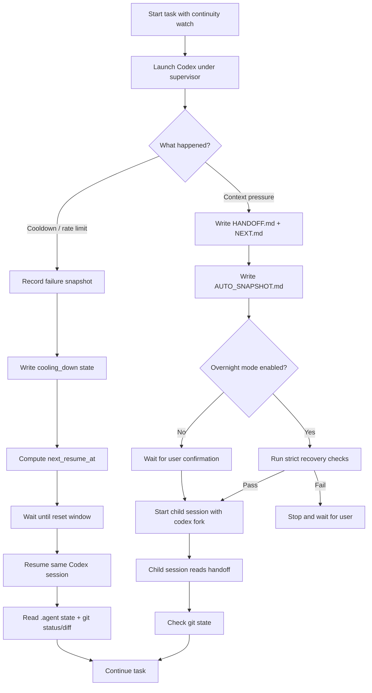

# Continuation Layer

> 給 Codex 長時間 CLI 任務使用的 durable continuation layer。

Continuation Layer 幫助 Codex 任務跨過長時間 agent 工作最常中斷的地方：

- cooldown / usage-limit 牆，
- context compaction，
- session 中斷，
- stale resume state，
- 需要人盯著看的 overnight run。

它**不會**繞過 provider limit。
它**不會**切換帳號。
它**不會**把私有聊天歷史當成唯一事實來源。

它會把 durable task state 寫進你的 repository，讓 coding agent 可以暫停、恢復，並從正確的位置繼續。

---

## 它做什麼

| 問題                               | Continuation Layer                                     |
| ---------------------------------- | ------------------------------------------------------ |
| Codex 在任務中途撞到 cooldown wall | Watch mode 等待 reset window，並 resume 同一 session   |
| Context pressure 可能遺失重要決策  | Continuation 前先寫 handoff files                      |
| Resume 看似接上但忘了任務意圖      | 繼續前先讀 `.agent/` durable state                     |
| 新 session 重掃 repo 並浪費 token  | Child session 從 handoff、git status、git diff 恢復    |
| Overnight work 需要人盯著          | Overnight mode 必須明確開啟，並受 recovery checks 保護 |

---

## Quick start

在你要保護的 repository 初始化 durable state：

```sh
continuity init --task-id refactor-auth
```

長任務請透過 watch mode 執行：

```sh
continuity watch "finish the auth refactor safely"
```

Watch mode 是長時間任務的建議入口。

它會在 foreground supervisor 之下啟動 Codex。如果 Codex 撞到 cooldown wall，supervisor 會記錄 state，等到 reset window，然後自動 resume 同一個 Codex session。

```text
Codex running
  ↓
cooldown detected
  ↓
record next_resume_at
  ↓
wait through reset window
  ↓
resume same Codex session
  ↓
continue from .agent state
```

查看 task state：

```sh
continuity status
continuity status --json
```

---

## Manual mode

當你不想保留長駐 watchdog process 時，可以使用 manual mode：

```sh
continuity start "finish this task"
continuity resume
```

Manual mode 只執行一次。如果偵測到 cooldown，它會記錄 `next_resume_at`，然後退出。

它**不會**保留 process。
它**不會**等待 reset window。
除非你執行 `continuity resume`，否則它**不會**自動 resume。

如果你要自動 cooldown wait 和 same-session resume，請使用 `continuity watch`。

---

## 重要限制

Continuation Layer 只能監控由它啟動的 provider process。

如果你直接執行 Codex：

```sh
codex
```

Continuation Layer 看不到該 process，不能捕捉 cooldown event，不能更新 `.agent/`，也不能稍後自動 resume 它。

v0.1 請使用：

```sh
continuity watch "your task"
```

Direct Codex-style usage 的 interactive terminal wrapper 已規劃，但不包含在 v0.1。

---

## 運作方式



---

## 核心概念

### 1. Cooldown walls become resumable

當 Codex 撞到 usage limit、rate limit、429 或 reset window 時，Continuation Layer 不會硬把 request 推過去。

它會：

1. 記錄 mechanical failure snapshot，
2. 把任務標成 `cooling_down`，
3. 記錄 `cooldown_detected_at`，
4. 計算 `next_resume_at`，
5. 記錄 reset-time provenance，
6. 在 `watch` mode 中等待，
7. reset 後 resume 同一個 Codex session。

Reset time 依照以下優先順序計算：

```text
provider explicit reset timestamp
> provider relative reset duration
> usage_window_started_at + 5h + buffer
> cooldown_detected_at + 5h + buffer
```

如果使用最後 fallback，會標記為 `cooldown_detected_fallback`。

Cooldown resume 是 same-session recovery path。Stale semantic handoff 是 warning，不是 blocker，因為 cooldown 等待本身可能讓 handoff 超過一般 freshness gate。

Git conflicts、missing session id、corrupted state、unreadable git state 仍然是 blockers。

---

### 2. Context pressure writes handoff before continuation

Context compaction 可能保留錯的細節，並丟掉重要細節。

Continuation Layer 會在開啟 continuation path 前，先寫 durable handoff state：

```text
context pressure
  ↓
write HANDOFF.md
  ↓
write NEXT.md
  ↓
capture git/runtime snapshot
  ↓
ask for confirmation by default
  ↓
start child session with codex fork
```

Child continuation 比 cooldown resume 更嚴格。Stale、missing 或 incomplete handoff 可能阻止 child-session continuation 和 overnight automation。

---

### 3. Overnight mode is explicit and guarded

Overnight continuation 預設關閉。

明確啟用：

```sh
continuity overnight enable
```

接著執行 continuation：

```sh
continuity continue
```

在啟動 unattended child session 前，Continuation Layer 會檢查：

- handoff exists，
- `NEXT.md` exists，
- git state is coherent，
- parent session is traceable，
- no conflicts are present，
- recovery checks pass。

如果 recovery 失敗，automation 會停止並等待 user。

關閉 overnight mode：

```sh
continuity overnight disable
```

---

### 4. Completed tasks do not pollute new tasks

標記目前任務完成：

```sh
continuity complete
```

開始乾淨的新任務：

```sh
continuity new-task --task-id next-task
```

系統會在寫入新 task state 前，先 archive active handoff 和 snapshot。

---

## Durable task state

Continuation Layer 會在受保護的 repository 建立 `.agent/` directory。

```text
.agent/
  HANDOFF.md        active task handoff
  NEXT.md           exact next step
  DECISIONS.md      durable decisions
  AUTO_SNAPSHOT.md  mechanical git/runtime snapshot
  state.json        machine-readable task state
  sessions.jsonl    session chain and lifecycle events
  logs/             supervisor logs
  handoffs/         archived handoffs
  snapshots/        archived snapshots
```

這些檔案讓 task state 可檢查、可稽核、可恢復。

這個 repository dogfoods Continuation Layer。已 commit 的 `.agent/` directory 是刻意保留的 sanitized project-state example，不應包含 secrets、provider-private dumps、machine-local logs 或 stale runtime noise。

---

## Install

需求：

- Node.js 20 or newer
- Git
- Codex CLI installed and authenticated
- 可以寫入 `.agent/` state 的 git repository

Clone 並安裝：

```sh
git clone https://github.com/Hsi431/continuation-layer.git
cd continuation-layer
npm install
```

從 source 執行：

```sh
node bin/continuity.mjs status
```

或 link 成本機 CLI：

```sh
npm link
continuity status
```

Codex plugin package 位於：

```text
plugins/codex-continuity/
```

即使沒有安裝 plugin，CLI supervisor 仍可從 source tree 使用。

---

## Commands

### Initialize

```sh
continuity init --task-id my-task
```

### Run with watchdog

```sh
continuity watch "finish this task"
```

### Run once

```sh
continuity start "finish this task"
```

### Resume after cooldown

```sh
continuity resume
```

### Write a snapshot

```sh
continuity snapshot
```

### Continue after context handoff

```sh
continuity continue
continuity continue --yes
```

`continue` 會寫 handoff 並等待 confirmation。
`continue --yes` 會執行 recovery checks，並用 `codex fork` 啟動 Codex child session。

### Overnight mode

```sh
continuity overnight enable
continuity overnight disable
```

### Complete and reset task state

```sh
continuity complete
continuity new-task --task-id next-task
```

### Dry run

```sh
continuity start --dry-run "refactor safely"
continuity watch --dry-run "refactor safely"
continuity resume --dry-run
continuity continue --dry-run
```

---

## Codex integration

Codex plugin package 包含：

- continuity skill，
- lifecycle hooks，
- hook command script，
- plugin metadata。

位置：

```text
plugins/codex-continuity/
```

Hook behavior：

| Hook           | Behavior                                            |
| -------------- | --------------------------------------------------- |
| `SessionStart` | Inject compact continuity context                   |
| `Stop`         | Write `.agent/AUTO_SNAPSHOT.md`                     |
| `PreCompact`   | Record context pressure and write handoff           |
| `PostCompact`  | Record compaction and prefer `.agent` durable state |

Hooks 只做短生命週期工作。它們不會 sleep 好幾小時。

Cooldown detection、waiting、same-session resume 由外部 supervisor 處理。

---

## Safety boundaries

Continuation Layer 不是 provider-limit bypass tool。

它不會：

- rotate accounts，
- fake reset windows，
- bypass cooldowns，
- sleep for hours inside hooks，
- auto commit，
- open pull requests automatically，
- force continuation from incomplete handoff，
- treat private provider session storage as source of truth，
- treat compacted summaries as the only source of truth。

它只做一件事：

```text
Make long tasks pause legally, hand off explicitly, and recover safely.
```

---

## Current status

這是 Codex-first v0.1 preview。

已完成：

- durable `.agent` state and validation，
- Codex adapter and supervisor，
- cooldown watchdog and same-session automatic resume，
- reset-time provenance，
- Codex continuity skill and plugin package，
- Codex lifecycle hooks，
- context handoff，
- `codex fork` child continuation，
- guarded overnight auto-continuation，
- completion / archive / cleanup，
- `AGENTS.md` 中的 behavioral acceptance rules。

---

## Known limitations

- v0.1 is Codex-first。
- Claude Code is documented as a future provider path, not a first-class runtime yet。
- Continuation Layer can only monitor provider processes it starts。
- Direct `codex` sessions are not captured。
- Interactive terminal wrapper support is planned, but not included in v0.1。
- Real provider smoke tests are opt-in and not part of CI。
- Context continuation asks for confirmation unless overnight mode is explicitly enabled。
- Provider CLI behavior and private session storage may change; private session storage is diagnostics only, not core state。

---

## Roadmap

### v0.1

- Codex CLI as primary provider
- Cooldown watchdog
- Same-session resume after cooldown
- Handoff-before-continuation
- Guarded overnight mode
- Completion / archive / cleanup
- Release packaging

### v0.x

- Dogfood feedback
- Packaging polish
- Clearer plugin installation flow
- Optional provider smoke tests
- Interactive terminal wrapper prototype

### v1

- Claude Code provider path
- Provider smoke tests
- Better circuit breaker policy
- Better recovery diagnostics

---

## Repository layout

```text
.agent/                     durable task state for this repo
.agents/skills/continuity   repo-local Codex skill entry
docs/                       architecture, safety, and release notes
plugins/codex-continuity/   Codex plugin package
plugins/claude-code-adapter/ future Claude Code adapter notes
src/                        core runtime, providers, supervisor
tests/                      unit and integration tests
AGENTS.md                   behavioral acceptance rules for agent work
```

---

## Development

Run tests：

```sh
npm test
```

Run syntax checks：

```sh
npm run check
```

Run formatting checks：

```sh
npm run format:check
```

Check package contents：

```sh
npm run pack:check
```

Manual release checks 請看：

```text
docs/RELEASE_CHECKLIST.md
docs/DOGFOOD.md
```

---

## License

Apache-2.0
