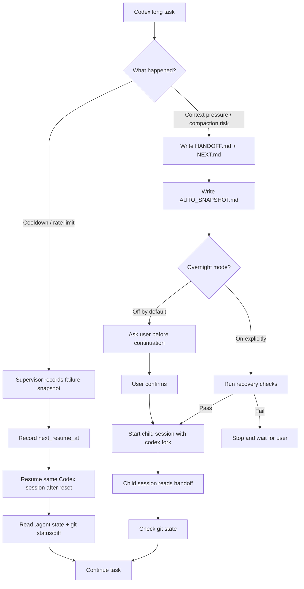

# Continuation Layer

[English](README.md)

> 讓 Codex 長任務跨過冷卻牆、context 壓縮與 session 中斷後，還能安全接續。

Continuation Layer 是一個給 CLI coding agent 用的任務續接層。

當 Codex 跑長任務時，最煩的不是它不會寫 code，而是它常常在快完成時撞到這些問題：

- 撞到 5 小時冷卻牆，任務停在一半。
- Context 快滿，被壓縮後漏掉關鍵決策。
- Resume 回來時看似接上了，其實已經忘了做過什麼。
- 新 session 又重新掃 repo，重做探索，浪費額度。
- 過夜跑任務時，還是得人盯著它有沒有死掉。

Continuation Layer 把任務狀態寫進 repo 裡，讓 agent 可以停下來、交接、恢復、再接著做。

```text
不是靠聊天紀錄續命。
不是靠 provider 私有 cache。
不是靠切帳號或繞限制。

它靠的是 repo 裡可檢查、可追蹤、可恢復的 durable state。
```

## Problem / Before-After

| Before                              | After                                             |
| ----------------------------------- | ------------------------------------------------- |
| Cooldown wall 讓任務停在一半        | Supervisor 記錄 cooldown state 和合法 resume 時間 |
| Context compaction 可能壓掉關鍵決策 | Continuation 前先寫 handoff                       |
| Resume 看似接上但任務意圖失準       | 接續前先讀 `.agent` durable state                 |
| 新 session 重掃 repo、浪費額度      | Child session 從 handoff、git status、diff 恢復   |
| 過夜任務需要人盯                    | Overnight mode 明確開啟，並有 recovery gates      |

## Highlights

- Codex-first v0.1 preview。
- Cooldown 後保留同一個 Codex session 的 resume state。
- Context 快滿時先 handoff，再 continuation。
- Child continuation 使用 `codex fork`。
- `.agent` durable state 是任務真實來源。
- Session chain 可追蹤。
- Overnight mode 預設關閉，必須明確打開。
- Recovery check 失敗會停下來，不會硬做。
- Supervisor 負責 cooldown 偵測與 resume state。
- Hooks 只做短生命週期工作，不 sleep 五小時。
- Task completion / archive / cleanup 已完成。
- 不切帳號。
- 不繞 provider limit。
- 不自動 commit。

## 安全邊界

Continuation Layer 不是 provider-limit bypass 工具。

它不會：

- 自動切帳號。
- 偽造 reset window。
- 在 hook 裡 sleep 五小時。
- 自動 commit。
- 自動開 PR。
- 從不完整 handoff 強行續做。
- 把 provider 私有 session storage 當核心狀態。
- 把 compacted summary 當唯一事實來源。

它只做一件事：

```text
讓長任務可以合法暫停，明確交接，安全恢復。
```

## 一張圖看懂



## 它解決什麼

### 1. 撞冷卻牆後，留下可恢復的 resume state

Codex 撞到 usage limit、rate limit、429 或 reset window 時，Continuation Layer 不會硬凹、不會切帳號、不會亂重開。

它會：

1. 記錄 failure snapshot。
2. 標記目前任務進入 cooldown。
3. 解析 reset time；解析不到就用保守預設時間。
4. 把 reset + buffer 記成 `next_resume_at`。
5. 在 reset 後被呼叫 resume 時，用 `codex resume` / `codex exec resume` 接回同一個 session。
6. 接續前先讀 `.agent` 狀態與 git 狀態。

```text
Cooldown wall
  ↓
record failure
  ↓
record legal resume time
  ↓
resume same session after reset
  ↓
continue from durable task state
```

### 2. Context 快滿時，不直接相信壓縮摘要

長任務最怕的是 context compaction 把錯的東西留下，把重要的東西壓掉。

Continuation Layer 的策略是：

1. 偵測到 context pressure 或 PreCompact。
2. 先寫 handoff。
3. 先寫下一步。
4. 先保存 git/runtime snapshot。
5. 預設停下來問你要不要開新的 continuation session。
6. 你同意後，用 `codex fork` 從父 session 開 child session 接續。

```text
Context pressure
  ↓
write handoff before compaction
  ↓
ask user
  ↓
codex fork child session
  ↓
recover from .agent + git state
```

新的 session 不用重新猜上下文，也不用重掃整個 repo。

### 3. 過夜模式：明確打開才會自動續

預設情況下，Continuation Layer 不會擅自開新 session。

但如果你要睡覺、出門、長時間不在，可以打開 overnight mode：

```sh
continuity overnight enable
```

打開後，context handoff 完成時，它可以自動開 child session 繼續跑。

但它不是無腦續跑。它會先檢查：

- handoff 是否存在。
- `NEXT.md` 是否存在。
- git state 是否合理。
- parent session 是否可追蹤。
- 是否有 conflict。
- 是否有不完整狀態。
- recovery check 是否通過。

只要 recovery check 失敗，它就會停下來等你。

### 4. 收尾時，舊任務不污染新任務

v0.1 已補上 cleanup lifecycle。

你可以把任務標記完成：

```sh
continuity complete
```

也可以開始乾淨的新任務：

```sh
continuity new-task --task-id next-task
```

系統會先把舊的 active handoff / snapshot archive 起來，再寫新的 active state。新任務不會沿用上一個任務的 handoff。

## 它怎麼保存任務狀態

Continuation Layer 會在你的 repo 裡建立 `.agent/`：

```text
.agent/
  HANDOFF.md          目前任務交接
  NEXT.md             下一個精準步驟
  DECISIONS.md        已確定的重要決策
  AUTO_SNAPSHOT.md    git/runtime 機械快照
  state.json          機器可讀任務狀態
  sessions.jsonl      parent/child session chain
  logs/               supervisor logs
  handoffs/           handoff archive
  snapshots/          snapshot archive
```

這些檔案讓 agent 的任務狀態變成可讀、可查、可恢復。

## 安裝

需求：

- Node.js 20 或更新版本。
- Git。
- 已安裝並登入 Codex CLI。
- 一個可以寫入 `.agent/` durable state 的 git repo。

Clone 並安裝：

```sh
git clone https://github.com/Fnatatzeng/continuation-layer.git
cd continuation-layer
npm install
```

從 source tree 使用：

```sh
node bin/continuity.mjs status
```

或 link 成本機 CLI：

```sh
npm link
continuity status
```

Codex plugin package 放在 `plugins/codex-continuity/`。Dogfood 時請透過你的 Codex plugin workflow 安裝或 link 這個 plugin，然後開新的 Codex thread，讓 hooks 和 skill 被載入。若尚未安裝 plugin，CLI 和 supervisor 仍可從 source tree 使用。

## Quick Start

在你要保護的 repo 裡：

初始化：

```sh
continuity init --task-id refactor-auth
```

查看狀態：

```sh
continuity status
continuity status --json
```

用 supervisor 啟動 Codex：

```sh
continuity start "refactor the auth module safely"
```

如果 Codex 撞到 cooldown，supervisor 會記錄狀態和合法 resume 時間；reset 後呼叫 resume 時會接回同一個 session。

寫 snapshot：

```sh
continuity snapshot
```

Context handoff 後開 child session：

```sh
continuity continue
continuity continue --yes
```

`continue` 會寫 handoff，然後停下來確認。`continue --yes` 會跑 recovery checks，通過後用 `codex fork` 開 child session。

過夜模式：

```sh
continuity overnight enable
continuity continue
```

關掉：

```sh
continuity overnight disable
```

任務完成與新任務：

```sh
continuity complete
continuity new-task --task-id next-task
```

只看 provider command，不真的啟動 Codex：

```sh
continuity start --dry-run "refactor the auth module safely"
continuity resume --dry-run
continuity continue --dry-run
```

## Codex Integration

Codex plugin package 放在：

```text
plugins/codex-continuity/
```

包含：

- continuity skill
- lifecycle hooks
- hook command script
- plugin metadata

Hook 行為：

| Hook           | 行為                                                  |
| -------------- | ----------------------------------------------------- |
| `SessionStart` | 注入 compact continuity context                       |
| `Stop`         | 寫入 `.agent/AUTO_SNAPSHOT.md`                        |
| `PreCompact`   | 記錄 context pressure，寫 handoff                     |
| `PostCompact`  | 記錄 compaction 發生，提醒後續優先信任 `.agent` state |

## 現在狀態

目前是 Codex-first preview，可以跑核心 continuity flow。

已完成：

- Durable `.agent` state and validation
- Codex adapter and supervisor
- Cooldown detection and same-session resume state
- Codex continuity skill and plugin package
- Codex lifecycle hooks
- Context handoff
- `codex fork` child continuation
- Guarded overnight auto-continuation
- Completion / archive / cleanup

## Known Limitations

- v0.1 是 Codex-first。
- Claude Code 目前是 v1/future provider path，還不是 first-class runtime。
- Provider CLI 行為和私有 session storage 可能變動；私有 session storage 只作診斷，不是核心狀態。
- 目前主要透過本機 unit/integration tests 和 dogfood flow 驗證。
- Context continuation 預設需要 user confirmation，除非明確啟用 overnight mode。
- 真 provider smoke tests 應保持 opt-in，不放進 CI。

## Roadmap

### v0.1

- Codex CLI as the primary provider.
- Safe cooldown resume state.
- Handoff-before-continuation.
- Guarded overnight mode.
- Completion / archive / cleanup.
- Release polish and packaging.

### v0.x

- Dogfood feedback.
- Packaging polish.
- Clearer plugin installation flow.
- Optional provider smoke tests.

### v1

- Claude Code provider path.
- `claude --resume`
- `claude --continue`
- `claude --fork-session`
- Claude `StopFailure` integration.
- Provider smoke tests.
- Better circuit breaker and recovery policy.

## Repository Layout

```text
.agent/                         durable task state for this repo
.agents/skills/continuity       repo-local Codex skill entry
docs/                           architecture, safety, and research notes
plugins/codex-continuity/       Codex plugin package
plugins/claude-code-adapter/    future Claude Code adapter notes
src/                            core runtime, providers, supervisor
tests/                          unit and integration tests
```

## Development

Run tests:

```sh
npm test
```

Run syntax checks:

```sh
npm run check
```

Run formatting checks:

```sh
npm run format:check
```

Check package contents:

```sh
npm run pack:check
```

如果你的本機有 Codex skill/plugin validators，請用你環境中的 validator path 驗證 packaged plugin。

手動 release 檢查請看 `docs/RELEASE_CHECKLIST.md` 和 `docs/DOGFOOD.md`。

## License

Apache-2.0
